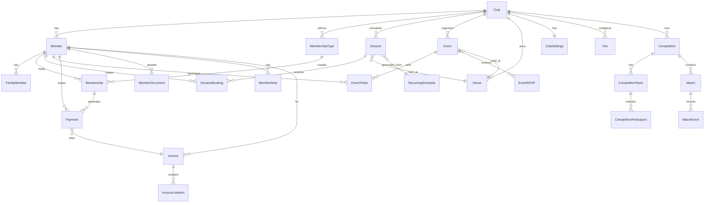

# The League - Database Design Document

## Overview

The League uses a relational database design optimized for multi-tenant SaaS operations. The database is implemented using SQL Server and managed through Entity Framework Core 8.0 with Code-First migrations.

### Design Principles

1. **Multi-Tenant Isolation** - Every tenant-scoped table includes a `ClubId` foreign key
2. **Soft Deletes** - Most entities support logical deletion via `IsActive` flag
3. **Audit Fields** - Created/Updated timestamps on key entities
4. **Referential Integrity** - Foreign keys with appropriate cascade behaviors
5. **Performance Indexes** - Composite indexes on frequently queried combinations

---

## Entity Relationship Diagram



---

## Core Entities

### Club (Tenant)

The root entity representing each sports club or organization.

| Column | Type | Constraints | Description |
|--------|------|-------------|-------------|
| Id | GUID | PK | Unique identifier |
| Name | NVARCHAR(200) | NOT NULL | Club display name |
| Slug | NVARCHAR(100) | NOT NULL, UNIQUE | URL-friendly identifier |
| Description | NVARCHAR(MAX) | NULL | Club description |
| LogoUrl | NVARCHAR(500) | NULL | Path to club logo |
| PrimaryColor | NVARCHAR(20) | DEFAULT '#1E40AF' | Branding primary color |
| SecondaryColor | NVARCHAR(20) | DEFAULT '#3B82F6' | Branding secondary color |
| ContactEmail | NVARCHAR(255) | NULL | Main contact email |
| ContactPhone | NVARCHAR(50) | NULL | Main contact phone |
| Address | NVARCHAR(500) | NULL | Physical address |
| Website | NVARCHAR(255) | NULL | Club website URL |
| ClubType | INT | NOT NULL | Enum: Cricket, Football, Rugby, etc. |
| IsActive | BIT | DEFAULT 1 | Soft delete flag |
| CreatedAt | DATETIME2 | DEFAULT GETUTCDATE() | Creation timestamp |
| RenewalDate | DATETIME2 | NULL | Annual renewal season start |
| PreferredPaymentProvider | INT | DEFAULT 0 | Enum: Stripe, PayPal |
| StripeAccountId | NVARCHAR(255) | NULL | Stripe Connect account |
| PayPalClientId | NVARCHAR(255) | NULL | PayPal client ID |
| SendGridApiKey | NVARCHAR(255) | NULL | SendGrid API key |
| FromEmail | NVARCHAR(255) | NULL | Email sender address |
| FromName | NVARCHAR(100) | NULL | Email sender name |

**Indexes:**
- `IX_Club_Slug` (UNIQUE) on `Slug`

---

### ClubSettings

Configuration settings for each club.

| Column | Type | Constraints | Description |
|--------|------|-------------|-------------|
| Id | GUID | PK | Unique identifier |
| ClubId | GUID | FK, UNIQUE | Reference to Club |
| AllowOnlineRegistration | BIT | DEFAULT 1 | Enable online signup |
| RequireEmergencyContact | BIT | DEFAULT 1 | Mandatory emergency contact |
| RequireMedicalInfo | BIT | DEFAULT 0 | Mandatory medical info |
| AllowFamilyAccounts | BIT | DEFAULT 1 | Enable family memberships |
| AllowOnlinePayments | BIT | DEFAULT 1 | Enable card payments |
| AllowManualPayments | BIT | DEFAULT 1 | Enable cash/transfer |
| AutoSendPaymentReminders | BIT | DEFAULT 1 | Automatic reminders |
| PaymentReminderDaysBefore | INT | DEFAULT 14 | Days before due date |
| PaymentReminderFrequency | INT | DEFAULT 7 | Days between reminders |
| AllowMemberBookings | BIT | DEFAULT 1 | Members can book sessions |
| MaxAdvanceBookingDays | INT | DEFAULT 30 | Booking horizon |
| CancellationNoticePeriodHours | INT | DEFAULT 24 | Cancel deadline |
| EnableWaitlist | BIT | DEFAULT 1 | Session waitlist |
| SendWelcomeEmail | BIT | DEFAULT 1 | Welcome email on register |
| SendBookingConfirmations | BIT | DEFAULT 1 | Booking confirmation emails |
| SendPaymentReceipts | BIT | DEFAULT 1 | Payment receipt emails |

**Relationships:**
- One-to-One with Club (CASCADE delete)

---

### Member

Individual club members.

| Column | Type | Constraints | Description |
|--------|------|-------------|-------------|
| Id | GUID | PK | Unique identifier |
| ClubId | GUID | FK, NOT NULL | Tenant discriminator |
| UserId | NVARCHAR(450) | FK, NULL | ASP.NET Identity user |
| MemberNumber | NVARCHAR(50) | NOT NULL | Club-unique ID (e.g., "MBR-001") |
| FirstName | NVARCHAR(100) | NOT NULL | First name |
| LastName | NVARCHAR(100) | NOT NULL | Last name |
| Email | NVARCHAR(255) | NOT NULL | Email address |
| Phone | NVARCHAR(50) | NULL | Phone number |
| DateOfBirth | DATE | NULL | Date of birth |
| Gender | INT | NULL | Enum: Male, Female, Other |
| Address | NVARCHAR(255) | NULL | Street address |
| AddressLine2 | NVARCHAR(255) | NULL | Address line 2 |
| City | NVARCHAR(100) | NULL | City |
| County | NVARCHAR(100) | NULL | County/State |
| PostCode | NVARCHAR(20) | NULL | Postal code |
| Country | NVARCHAR(100) | NULL | Country |
| ProfilePhotoUrl | NVARCHAR(500) | NULL | Profile picture path |
| EmergencyContactName | NVARCHAR(200) | NULL | Emergency contact |
| EmergencyContactPhone | NVARCHAR(50) | NULL | Emergency phone |
| EmergencyContactRelation | NVARCHAR(50) | NULL | Relationship |
| MedicalConditions | NVARCHAR(MAX) | NULL | Medical notes |
| Allergies | NVARCHAR(500) | NULL | Known allergies |
| IsFamilyAccount | BIT | DEFAULT 0 | Primary family account |
| PrimaryMemberId | GUID | FK, NULL | Parent account (if dependent) |
| Status | INT | NOT NULL | Enum: Pending, Active, Expired, Suspended |
| JoinedDate | DATETIME2 | DEFAULT GETUTCDATE() | Registration date |
| LastLoginDate | DATETIME2 | NULL | Last portal login |
| IsActive | BIT | DEFAULT 1 | Soft delete flag |
| EmailVerified | BIT | DEFAULT 0 | Email verified |
| MarketingOptIn | BIT | DEFAULT 0 | Marketing consent |
| StripeCustomerId | NVARCHAR(255) | NULL | Stripe customer ID |
| PayPalPayerId | NVARCHAR(255) | NULL | PayPal payer ID |

**Indexes:**
- `IX_Member_ClubId_Email` on `(ClubId, Email)`
- `IX_Member_ClubId_Status` on `(ClubId, Status)`
- `IX_Member_ClubId_MemberNumber` (UNIQUE) on `(ClubId, MemberNumber)`

**Relationships:**
- Many-to-One with Club (RESTRICT delete)
- Many-to-One with self (PrimaryMember) for family hierarchy

---

### FamilyMember

Dependents linked to a primary member account.

| Column | Type | Constraints | Description |
|--------|------|-------------|-------------|
| Id | GUID | PK | Unique identifier |
| ClubId | GUID | FK, NOT NULL | Tenant discriminator |
| PrimaryMemberId | GUID | FK, NOT NULL | Parent member |
| FirstName | NVARCHAR(100) | NOT NULL | First name |
| LastName | NVARCHAR(100) | NOT NULL | Last name |
| DateOfBirth | DATE | NULL | Date of birth |
| Relation | INT | NOT NULL | Enum: Spouse, Child, Sibling, Parent |
| MedicalConditions | NVARCHAR(MAX) | NULL | Medical notes |
| Allergies | NVARCHAR(500) | NULL | Known allergies |
| IsActive | BIT | DEFAULT 1 | Soft delete flag |

**Relationships:**
- Many-to-One with Member (CASCADE delete)

---

### MembershipType

Configurable membership categories per club.

| Column | Type | Constraints | Description |
|--------|------|-------------|-------------|
| Id | GUID | PK | Unique identifier |
| ClubId | GUID | FK, NOT NULL | Tenant discriminator |
| Name | NVARCHAR(100) | NOT NULL | Type name (e.g., "Senior", "Junior") |
| Description | NVARCHAR(MAX) | NULL | Full description |
| ShortDescription | NVARCHAR(500) | NULL | Brief description |
| Category | INT | NOT NULL | Enum: Individual, Family, Student, etc. |
| BasePrice | DECIMAL(18,2) | NOT NULL | Standard annual price |
| MonthlyFee | DECIMAL(18,2) | NULL | Monthly payment option |
| QuarterlyFee | DECIMAL(18,2) | NULL | Quarterly payment option |
| SessionFee | DECIMAL(18,2) | NULL | Pay-as-you-go rate |
| JoiningFee | DECIMAL(18,2) | NULL | One-time joining fee |
| MinAge | INT | NULL | Minimum age restriction |
| MaxAge | INT | NULL | Maximum age restriction |
| MaxFamilyMembers | INT | NULL | Family plan limit |
| IsActive | BIT | DEFAULT 1 | Available for signup |
| AllowOnlineSignup | BIT | DEFAULT 1 | Show on registration |
| SortOrder | INT | DEFAULT 0 | Display order |
| IncludesBooking | BIT | DEFAULT 1 | Session booking included |
| IncludesEvents | BIT | DEFAULT 1 | Event access included |
| MaxSessionsPerWeek | INT | NULL | Weekly session limit |
| ColorCode | NVARCHAR(20) | NULL | UI color indicator |
| Currency | NVARCHAR(3) | DEFAULT 'GBP' | Currency code |

**Indexes:**
- `IX_MembershipType_ClubId` on `ClubId`
- `IX_MembershipType_ClubId_IsActive` on `(ClubId, IsActive)`

---

### Membership

Member enrollment in a membership type.

| Column | Type | Constraints | Description |
|--------|------|-------------|-------------|
| Id | GUID | PK | Unique identifier |
| ClubId | GUID | FK, NOT NULL | Tenant discriminator |
| MemberId | GUID | FK, NOT NULL | Member reference |
| MembershipTypeId | GUID | FK, NOT NULL | Type reference |
| StartDate | DATETIME2 | NOT NULL | Membership start |
| EndDate | DATETIME2 | NOT NULL | Membership expiry |
| PaymentType | INT | NOT NULL | Enum: Annual, Monthly, PayAsYouGo |
| Status | INT | NOT NULL | Enum: Active, PendingPayment, Expired |
| AmountPaid | DECIMAL(18,2) | DEFAULT 0 | Total paid |
| AmountDue | DECIMAL(18,2) | DEFAULT 0 | Outstanding balance |
| LastPaymentDate | DATETIME2 | NULL | Last payment |
| NextPaymentDate | DATETIME2 | NULL | Next due date |
| AutoRenew | BIT | DEFAULT 0 | Auto-renewal enabled |
| Notes | NVARCHAR(MAX) | NULL | Internal notes |
| CreatedAt | DATETIME2 | DEFAULT GETUTCDATE() | Creation date |

**Indexes:**
- `IX_Membership_ClubId_Status` on `(ClubId, Status)`
- `IX_Membership_MemberId` on `MemberId`
- `IX_Membership_EndDate` on `EndDate` (for expiry queries)

---

### Payment

Financial transactions.

| Column | Type | Constraints | Description |
|--------|------|-------------|-------------|
| Id | GUID | PK | Unique identifier |
| ClubId | GUID | FK, NOT NULL | Tenant discriminator |
| MemberId | GUID | FK, NOT NULL | Payer reference |
| MembershipId | GUID | FK, NULL | Related membership |
| InvoiceId | GUID | FK, NULL | Related invoice |
| Amount | DECIMAL(18,2) | NOT NULL | Payment amount |
| Currency | NVARCHAR(3) | DEFAULT 'GBP' | Currency code |
| Status | INT | NOT NULL | Enum: Pending, Completed, Failed, Refunded |
| Method | INT | NOT NULL | Enum: Stripe, PayPal, Cash, BankTransfer |
| Type | INT | NOT NULL | Enum: Membership, Event, Session |
| Description | NVARCHAR(500) | NULL | Payment description |
| PaymentDate | DATETIME2 | NOT NULL | Transaction date |
| ProcessedDate | DATETIME2 | NULL | Completion date |
| StripePaymentIntentId | NVARCHAR(255) | NULL | Stripe reference |
| PayPalTransactionId | NVARCHAR(255) | NULL | PayPal reference |
| ReceiptNumber | NVARCHAR(50) | NULL | Receipt reference |
| ManualPaymentReference | NVARCHAR(255) | NULL | Manual payment ref |
| RecordedBy | NVARCHAR(255) | NULL | Admin who recorded |

**Indexes:**
- `IX_Payment_ClubId_Status` on `(ClubId, Status)`
- `IX_Payment_MemberId` on `MemberId`
- `IX_Payment_PaymentDate` on `PaymentDate`

---

### Session

Training sessions or activities.

| Column | Type | Constraints | Description |
|--------|------|-------------|-------------|
| Id | GUID | PK | Unique identifier |
| ClubId | GUID | FK, NOT NULL | Tenant discriminator |
| VenueId | GUID | FK, NULL | Venue reference |
| RecurringScheduleId | GUID | FK, NULL | Parent schedule |
| Title | NVARCHAR(200) | NOT NULL | Session title |
| Description | NVARCHAR(MAX) | NULL | Session description |
| Category | INT | NOT NULL | Enum: U11, U13, Seniors, etc. |
| StartTime | DATETIME2 | NOT NULL | Session start |
| EndTime | DATETIME2 | NOT NULL | Session end |
| Capacity | INT | NOT NULL | Maximum attendees |
| CurrentBookings | INT | DEFAULT 0 | Current count |
| SessionFee | DECIMAL(18,2) | NULL | Pay-per-session cost |
| IsRecurring | BIT | DEFAULT 0 | Part of recurring series |
| IsCancelled | BIT | DEFAULT 0 | Cancelled flag |
| CancellationReason | NVARCHAR(500) | NULL | Cancellation reason |

**Indexes:**
- `IX_Session_ClubId_StartTime` on `(ClubId, StartTime)`
- `IX_Session_VenueId` on `VenueId`

---

### SessionBooking

Member bookings for sessions.

| Column | Type | Constraints | Description |
|--------|------|-------------|-------------|
| Id | GUID | PK | Unique identifier |
| ClubId | GUID | FK, NOT NULL | Tenant discriminator |
| SessionId | GUID | FK, NOT NULL | Session reference |
| MemberId | GUID | FK, NOT NULL | Member reference |
| FamilyMemberId | GUID | FK, NULL | Family member (if applicable) |
| BookedAt | DATETIME2 | NOT NULL | Booking timestamp |
| Status | INT | NOT NULL | Enum: Confirmed, Cancelled, Attended |
| Attended | BIT | DEFAULT 0 | Attendance marked |
| CheckedInAt | DATETIME2 | NULL | Check-in time |
| Notes | NVARCHAR(500) | NULL | Booking notes |
| CancellationReason | NVARCHAR(500) | NULL | Cancellation reason |
| CancelledAt | DATETIME2 | NULL | Cancellation time |

**Indexes:**
- `IX_SessionBooking_SessionId` on `SessionId`
- `IX_SessionBooking_MemberId` on `MemberId`
- `IX_SessionBooking_ClubId_Status` on `(ClubId, Status)`

---

### RecurringSchedule

Templates for generating recurring sessions.

| Column | Type | Constraints | Description |
|--------|------|-------------|-------------|
| Id | GUID | PK | Unique identifier |
| ClubId | GUID | FK, NOT NULL | Tenant discriminator |
| VenueId | GUID | FK, NULL | Default venue |
| Title | NVARCHAR(200) | NOT NULL | Schedule title |
| Description | NVARCHAR(MAX) | NULL | Schedule description |
| Category | INT | NOT NULL | Session category |
| DayOfWeek | INT | NOT NULL | Day (0=Sunday, 6=Saturday) |
| StartTime | TIME | NOT NULL | Start time |
| EndTime | TIME | NOT NULL | End time |
| Capacity | INT | NOT NULL | Session capacity |
| ScheduleStartDate | DATE | NOT NULL | Schedule begins |
| ScheduleEndDate | DATE | NULL | Schedule ends |
| IsActive | BIT | DEFAULT 1 | Currently active |
| SessionFee | DECIMAL(18,2) | NULL | Default session fee |

---

### Event

Club events (social, tournaments, meetings).

| Column | Type | Constraints | Description |
|--------|------|-------------|-------------|
| Id | GUID | PK | Unique identifier |
| ClubId | GUID | FK, NOT NULL | Tenant discriminator |
| VenueId | GUID | FK, NULL | Event venue |
| Title | NVARCHAR(200) | NOT NULL | Event title |
| Description | NVARCHAR(MAX) | NULL | Event description |
| Type | INT | NOT NULL | Enum: Social, Tournament, AGM |
| StartDateTime | DATETIME2 | NOT NULL | Event start |
| EndDateTime | DATETIME2 | NOT NULL | Event end |
| Location | NVARCHAR(500) | NULL | Location details |
| Capacity | INT | NULL | Maximum attendees |
| CurrentAttendees | INT | DEFAULT 0 | Current count |
| IsTicketed | BIT | DEFAULT 0 | Requires ticket purchase |
| TicketPrice | DECIMAL(18,2) | NULL | Standard ticket price |
| MemberTicketPrice | DECIMAL(18,2) | NULL | Member discount price |
| TicketSalesEndDate | DATETIME2 | NULL | Sales cutoff |
| RequiresRSVP | BIT | DEFAULT 0 | RSVP required |
| RSVPDeadline | DATETIME2 | NULL | RSVP cutoff |
| IsCancelled | BIT | DEFAULT 0 | Cancelled flag |
| IsPublished | BIT | DEFAULT 1 | Visible to members |
| ImageUrl | NVARCHAR(500) | NULL | Event image |

**Indexes:**
- `IX_Event_ClubId_StartDateTime` on `(ClubId, StartDateTime)`
- `IX_Event_ClubId_IsPublished` on `(ClubId, IsPublished)`

---

### Venue

Physical locations for sessions and events.

| Column | Type | Constraints | Description |
|--------|------|-------------|-------------|
| Id | GUID | PK | Unique identifier |
| ClubId | GUID | FK, NOT NULL | Tenant discriminator |
| Name | NVARCHAR(200) | NOT NULL | Venue name |
| Description | NVARCHAR(MAX) | NULL | Venue description |
| Address | NVARCHAR(500) | NULL | Street address |
| PostCode | NVARCHAR(20) | NULL | Postal code |
| Latitude | DECIMAL(9,6) | NULL | GPS latitude |
| Longitude | DECIMAL(9,6) | NULL | GPS longitude |
| Capacity | INT | NULL | Maximum capacity |
| Facilities | NVARCHAR(MAX) | NULL | Available facilities |
| ImageUrl | NVARCHAR(500) | NULL | Venue image |
| IsActive | BIT | DEFAULT 1 | Currently available |
| IsPrimary | BIT | DEFAULT 0 | Primary venue flag |

---

### Invoice

Financial invoices for members.

| Column | Type | Constraints | Description |
|--------|------|-------------|-------------|
| Id | GUID | PK | Unique identifier |
| ClubId | GUID | FK, NOT NULL | Tenant discriminator |
| MemberId | GUID | FK, NOT NULL | Invoice recipient |
| InvoiceNumber | NVARCHAR(50) | NOT NULL | Unique invoice number |
| IssueDate | DATETIME2 | NOT NULL | Invoice date |
| DueDate | DATETIME2 | NOT NULL | Payment deadline |
| SubTotal | DECIMAL(18,2) | NOT NULL | Pre-tax total |
| TaxAmount | DECIMAL(18,2) | DEFAULT 0 | Tax amount |
| TotalAmount | DECIMAL(18,2) | NOT NULL | Invoice total |
| PaidAmount | DECIMAL(18,2) | DEFAULT 0 | Amount paid |
| Status | INT | NOT NULL | Enum: Draft, Sent, Paid, Overdue |
| Notes | NVARCHAR(MAX) | NULL | Invoice notes |
| SentAt | DATETIME2 | NULL | Email sent timestamp |

**Indexes:**
- `IX_Invoice_ClubId_InvoiceNumber` (UNIQUE) on `(ClubId, InvoiceNumber)`
- `IX_Invoice_ClubId_Status` on `(ClubId, Status)`
- `IX_Invoice_MemberId` on `MemberId`

---

### Fee

Configurable fees per club.

| Column | Type | Constraints | Description |
|--------|------|-------------|-------------|
| Id | GUID | PK | Unique identifier |
| ClubId | GUID | FK, NOT NULL | Tenant discriminator |
| Name | NVARCHAR(100) | NOT NULL | Fee name |
| Description | NVARCHAR(500) | NULL | Fee description |
| Type | INT | NOT NULL | Enum: Membership, Event, Session |
| Amount | DECIMAL(18,2) | NOT NULL | Fee amount |
| Currency | NVARCHAR(3) | DEFAULT 'GBP' | Currency |
| Frequency | INT | NOT NULL | Enum: OneTime, Monthly, Annual |
| IsActive | BIT | DEFAULT 1 | Currently active |
| IsTaxable | BIT | DEFAULT 0 | Subject to tax |
| TaxRateId | GUID | FK, NULL | Tax rate reference |

---

### Competition

Sports competitions and leagues.

| Column | Type | Constraints | Description |
|--------|------|-------------|-------------|
| Id | GUID | PK | Unique identifier |
| ClubId | GUID | FK, NOT NULL | Tenant discriminator |
| SeasonId | GUID | FK, NULL | Season reference |
| Name | NVARCHAR(200) | NOT NULL | Competition name |
| Description | NVARCHAR(MAX) | NULL | Description |
| Type | INT | NOT NULL | Enum: League, Tournament, Cup |
| Format | INT | NOT NULL | Enum: RoundRobin, Knockout |
| Status | INT | NOT NULL | Enum: Draft, InProgress, Completed |
| StartDate | DATETIME2 | NOT NULL | Competition start |
| EndDate | DATETIME2 | NULL | Competition end |
| EntryFee | DECIMAL(18,2) | NULL | Team entry fee |
| PointsForWin | INT | DEFAULT 3 | League points for win |
| PointsForDraw | INT | DEFAULT 1 | League points for draw |
| PointsForLoss | INT | DEFAULT 0 | League points for loss |

---

### CompetitionTeam

Teams registered in competitions.

| Column | Type | Constraints | Description |
|--------|------|-------------|-------------|
| Id | GUID | PK | Unique identifier |
| ClubId | GUID | FK, NOT NULL | Tenant discriminator |
| CompetitionId | GUID | FK, NOT NULL | Competition reference |
| Name | NVARCHAR(200) | NOT NULL | Team name |
| CaptainMemberId | GUID | FK, NULL | Team captain |
| Status | INT | NOT NULL | Enum: Registered, Active, Withdrawn |
| HomeVenueId | GUID | FK, NULL | Home ground |
| PrimaryColor | NVARCHAR(20) | NULL | Team color |
| LogoUrl | NVARCHAR(500) | NULL | Team logo |

---

### Match

Individual matches within competitions.

| Column | Type | Constraints | Description |
|--------|------|-------------|-------------|
| Id | GUID | PK | Unique identifier |
| ClubId | GUID | FK, NOT NULL | Tenant discriminator |
| CompetitionId | GUID | FK, NOT NULL | Competition reference |
| RoundId | GUID | FK, NULL | Round reference |
| HomeTeamId | GUID | FK, NOT NULL | Home team |
| AwayTeamId | GUID | FK, NOT NULL | Away team |
| VenueId | GUID | FK, NULL | Match venue |
| ScheduledDateTime | DATETIME2 | NOT NULL | Scheduled time |
| Status | INT | NOT NULL | Enum: Scheduled, InProgress, Completed |
| HomeScore | INT | NULL | Home team score |
| AwayScore | INT | NULL | Away team score |
| Result | INT | NULL | Enum: HomeWin, AwayWin, Draw |
| RefereeMemberId | GUID | FK, NULL | Match referee |
| Notes | NVARCHAR(MAX) | NULL | Match notes |

---

### SystemConfiguration

Global system settings (not tenant-scoped).

| Column | Type | Constraints | Description |
|--------|------|-------------|-------------|
| Id | GUID | PK | Unique identifier |
| PaymentProvider | NVARCHAR(50) | NOT NULL | Active payment provider |
| StripePublishableKey | NVARCHAR(500) | NULL | Stripe public key |
| StripeSecretKey | NVARCHAR(500) | NULL | Stripe secret (encrypted) |
| EmailProvider | NVARCHAR(50) | NOT NULL | Active email provider |
| SendGridApiKey | NVARCHAR(500) | NULL | SendGrid key (encrypted) |
| DefaultFromEmail | NVARCHAR(255) | NOT NULL | System sender email |
| DefaultFromName | NVARCHAR(100) | NOT NULL | System sender name |
| MaintenanceMode | BIT | DEFAULT 0 | System in maintenance |
| AllowNewRegistrations | BIT | DEFAULT 1 | Registration enabled |
| PlatformName | NVARCHAR(100) | DEFAULT 'The League' | Platform name |
| PrimaryColor | NVARCHAR(20) | DEFAULT '#1E40AF' | Brand color |
| LogoUrl | NVARCHAR(500) | NULL | Platform logo |
| UpdatedAt | DATETIME2 | NOT NULL | Last update |
| UpdatedBy | NVARCHAR(255) | NOT NULL | Last updater |

---

## Migration Strategy

### Migration Phases

The database schema is evolved through EF Core migrations organized by feature phase:

| Migration | Phase | Description |
|-----------|-------|-------------|
| InitialCreate | 1 | Core entities: Club, Member, Session, Event, Venue |
| EnhancedMemberManagement | 2 | Member notes, custom fields, family improvements |
| MembershipPlansAndPricing | 3 | Enhanced membership types, discounts, freezes |
| Phase4FeesAndPayments | 4 | Fees, invoices, payment plans |
| Phase5FinancialManagement | 5 | Chart of accounts, journal entries, budgets |
| Phase6ExpenseManagement | 6 | Vendors, expenses, purchase orders |
| Phase7FacilityManagement | 7 | Facility bookings, maintenance |
| Phase8EquipmentManagement | 8 | Equipment tracking, loans |
| Phase9ProgramManagement | 9 | Programs, enrollments, certificates |
| Phase10EventsAndCompetitions | 10 | Enhanced events, competitions, matches |
| AddSystemConfiguration | 11 | Global system configuration |

### Migration Commands

```bash
# Create new migration
dotnet ef migrations add MigrationName -p TheLeague.Infrastructure -s TheLeague.Api

# Apply migrations
dotnet ef database update -p TheLeague.Infrastructure -s TheLeague.Api

# Revert to specific migration
dotnet ef database update PreviousMigrationName -p TheLeague.Infrastructure -s TheLeague.Api
```

---

## Indexing Strategy

### Primary Indexes

All entities use GUID primary keys with clustered indexes.

### Composite Indexes

| Table | Columns | Purpose |
|-------|---------|---------|
| Member | (ClubId, Email) | Tenant-scoped email lookup |
| Member | (ClubId, Status) | Member filtering |
| Member | (ClubId, MemberNumber) | Unique member numbers per club |
| Membership | (ClubId, Status) | Active membership queries |
| Session | (ClubId, StartTime) | Session scheduling |
| Payment | (ClubId, PaymentDate) | Financial reports |
| Invoice | (ClubId, Status) | Invoice management |

### Foreign Key Indexes

All foreign keys have supporting indexes for JOIN performance.

---

## Data Integrity Rules

### Cascade Delete Behaviors

| Parent | Child | Behavior | Rationale |
|--------|-------|----------|-----------|
| Club | ClubSettings | CASCADE | Settings are club-specific |
| Club | Member | RESTRICT | Prevent accidental member loss |
| Member | FamilyMember | CASCADE | Family tied to primary |
| Member | SessionBooking | RESTRICT | Preserve booking history |
| Member | Payment | RESTRICT | Preserve financial records |
| Session | SessionBooking | CASCADE | Bookings for deleted sessions |

### Business Rules

1. **Member Number Uniqueness** - Unique per club, generated sequentially
2. **Invoice Number Uniqueness** - Unique per club, format: INV-YYYY-NNNN
3. **Email Uniqueness** - Unique per club (same person can be in multiple clubs)
4. **Membership Overlap** - Prevented by application logic
5. **Session Capacity** - Enforced at booking time

---

## Performance Considerations

### Query Optimization

1. **Global Filters** - Automatically applied WHERE ClubId = @TenantId
2. **Pagination** - All list queries use OFFSET/FETCH
3. **Projection** - Select only required columns
4. **Include Optimization** - Explicit includes, no lazy loading

### Expected Data Volumes

| Entity | Expected Rows (per club) | Growth Rate |
|--------|-------------------------|-------------|
| Member | 50 - 5,000 | Moderate |
| Session | 500 - 10,000/year | Seasonal |
| SessionBooking | 5,000 - 100,000/year | High |
| Payment | 200 - 10,000/year | Moderate |
| Event | 20 - 200/year | Low |

---

*Document Version: 1.0*
*Last Updated: Pre-Development Planning Phase*
