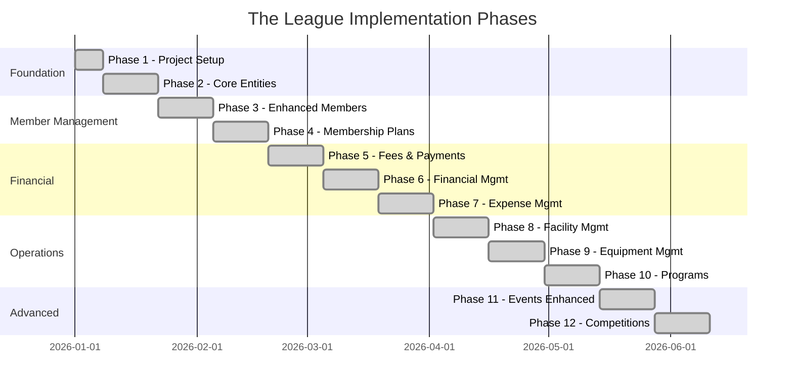

# The League - Implementation Roadmap

## Overview

This document outlines the phased implementation roadmap for The League platform. The development is organized into 10 distinct phases, each building upon the previous to create a comprehensive membership management system.

---

## High-Level Timeline



---

## Phase 1: Project Foundation

### Objectives
- Establish solution architecture
- Configure development environment
- Set up core infrastructure

### Deliverables

| Component | Description | Status |
|-----------|-------------|--------|
| Solution Structure | Create TheLeague.Api, Core, Infrastructure, Tests | Complete |
| Database Setup | Configure EF Core with SQL Server | Complete |
| Authentication | ASP.NET Identity + JWT | Complete |
| Multi-Tenancy | TenantMiddleware + Global Query Filters | Complete |
| API Documentation | Swagger/OpenAPI | Complete |
| Angular Setup | Angular 19 + Tailwind CSS | Complete |
| CORS Configuration | Development CORS policy | Complete |

### Technical Decisions
- **Database:** SQL Server with Code-First migrations
- **Multi-Tenancy:** Shared database with ClubId discriminator
- **Authentication:** JWT with 15-minute access tokens, 7-day refresh tokens
- **Frontend:** Angular 19 standalone components

### Migration
```
20260108113014_InitialCreate
```

---

## Phase 2: Core Entities

### Objectives
- Implement fundamental domain entities
- Create basic CRUD operations
- Establish service layer patterns

### Entities Created

| Entity | Description | Fields |
|--------|-------------|--------|
| Club | Tenant/organization | Name, Slug, Type, Branding, Contact |
| ClubSettings | Club configuration | Registration, Payments, Booking settings |
| Member | Club members | Personal details, Status, Contact info |
| MembershipType | Membership categories | Pricing, Age restrictions, Privileges |
| Membership | Member enrollments | Dates, Status, Payment type |
| Session | Training/activities | DateTime, Venue, Capacity, Category |
| SessionBooking | Session reservations | Member, Status, Attendance |
| Event | Club events | DateTime, Type, Capacity, Ticketing |
| Venue | Physical locations | Address, Capacity, Facilities |
| Payment | Financial transactions | Amount, Method, Status |

### API Endpoints Implemented
- `/api/auth/*` - Authentication endpoints
- `/api/admin/clubs/*` - Club management (SuperAdmin)
- `/api/club/*` - Club profile and settings
- `/api/members/*` - Member CRUD
- `/api/sessions/*` - Session management
- `/api/events/*` - Event management
- `/api/payments/*` - Payment recording
- `/api/venues/*` - Venue management

### Frontend Components
- Login, Register, Forgot Password pages
- Admin club management
- Club dashboard
- Member list, detail, form
- Session list, detail, form
- Basic payment recording

---

## Phase 3: Enhanced Member Management

### Objectives
- Extend member profiles with detailed information
- Implement family account support
- Add custom fields capability

### Entities Created/Extended

| Entity | Description |
|--------|-------------|
| FamilyMember | Dependents linked to primary account |
| MemberDocument | Uploaded documents (photos, forms) |
| MemberNote | Internal staff notes |
| CustomFieldDefinition | Club-specific custom fields |

### Features Implemented
- Family member CRUD
- Primary/dependent relationship
- Emergency contact management
- Medical information storage
- Member notes with categories
- Custom field definitions
- Profile photo upload

### Migration
```
20260108114553_EnhancedMemberManagement
```

---

## Phase 4: Membership Plans & Pricing

### Objectives
- Flexible membership type configuration
- Support various billing cycles
- Membership lifecycle management

### Entities Created

| Entity | Description |
|--------|-------------|
| MembershipDiscount | Promotional discounts |
| MembershipFreeze | Temporary membership pauses |
| GuestPass | Visitor passes |
| MembershipWaitlist | Waitlist for limited memberships |

### Enhanced MembershipType Fields
- Weekly, Fortnightly, Monthly, Quarterly, Annual fees
- Joining fee configuration
- Age restrictions (min/max)
- Family member limits
- Access type (Full, Limited, Peak/Off-Peak)
- Color coding and icons

### Features Implemented
- Multiple pricing tiers
- Membership enrollment workflow
- Renewal processing
- Cancellation handling
- Freeze/pause functionality
- Waitlist management

### Migration
```
20260108122449_MembershipPlansAndPricing
```

---

## Phase 5: Fees & Payments

### Objectives
- Configurable fee types
- Invoice generation and management
- Payment plan support

### Entities Created

| Entity | Description |
|--------|-------------|
| Fee | Configurable fee types |
| Invoice | Financial invoices |
| InvoiceLineItem | Invoice line items |
| PaymentPlan | Payment installment plans |
| PaymentInstallment | Individual installments |
| MemberBalance | Member account balances |
| BalanceTransaction | Balance ledger entries |
| Refund | Refund transactions |
| PaymentReminder | Automated reminders |

### Features Implemented
- Fee type configuration
- Invoice creation and sending
- Payment recording against invoices
- Payment plan setup
- Automated payment reminders
- Refund processing
- Member balance tracking

### Migration
```
20260108130931_Phase4FeesAndPayments
```

---

## Phase 6: Financial Management

### Objectives
- Double-entry accounting support
- Financial reporting foundation
- Budget tracking

### Entities Created

| Entity | Description |
|--------|-------------|
| ChartOfAccount | Account structure |
| JournalEntry | Accounting entries |
| JournalEntryLine | Entry line items |
| FiscalYear | Financial years |
| FiscalPeriod | Accounting periods |
| TaxRate | Tax configurations |
| BankReconciliation | Bank statement matching |
| Budget | Budget definitions |
| BudgetLine | Budget line items |
| FinancialAuditLog | Financial audit trail |
| SavedFinancialReport | Saved report configurations |

### Features Implemented
- Chart of accounts setup
- Journal entry posting
- Fiscal year management
- Tax rate configuration
- Basic bank reconciliation
- Budget tracking
- Financial audit logging

### Migration
```
20260108132035_Phase5FinancialManagement
```

---

## Phase 7: Expense Management

### Objectives
- Vendor management
- Expense tracking and approval
- Purchase order system

### Entities Created

| Entity | Description |
|--------|-------------|
| Vendor | Supplier/contractor records |
| Expense | Expense claims |
| ExpenseLineItem | Expense breakdown |
| ExpenseApproval | Approval workflow |
| ExpenseAttachment | Receipt uploads |
| ExpensePayment | Payment records |
| PurchaseOrder | Purchase orders |
| PurchaseOrderLine | PO line items |
| PurchaseOrderReceipt | Goods receipt |

### Features Implemented
- Vendor CRUD
- Expense submission
- Approval workflow
- Receipt attachments
- Purchase order creation
- Goods receipt processing
- Payment tracking

### Migration
```
20260108132635_Phase6ExpenseManagement
```

---

## Phase 8: Facility Management

### Objectives
- Facility booking system
- Maintenance scheduling
- Operating hours management

### Entities Created

| Entity | Description |
|--------|-------------|
| Facility | Bookable facilities (courts, rooms) |
| FacilityAvailability | Availability slots |
| FacilityPricing | Pricing tiers |
| FacilityBooking | Reservations |
| FacilityMaintenance | Maintenance records |
| FacilityBlockout | Blocked periods |
| VenueOperatingSchedule | Operating hours |
| VenueHoliday | Holiday closures |

### Features Implemented
- Facility definitions
- Availability calendar
- Member/non-member pricing
- Booking workflow
- Maintenance scheduling
- Holiday configuration

### Migration
```
20260108133744_Phase7FacilityManagement
```

---

## Phase 9: Equipment Management

### Objectives
- Equipment inventory
- Loan tracking
- Maintenance scheduling

### Entities Created

| Entity | Description |
|--------|-------------|
| Equipment | Equipment inventory |
| EquipmentLoan | Equipment loans |
| EquipmentMaintenance | Maintenance records |
| EquipmentReservation | Advance reservations |

### Features Implemented
- Equipment catalog
- Loan/checkout workflow
- Return processing
- Condition tracking
- Maintenance scheduling
- Reservation system

### Migration
```
20260108134221_Phase8EquipmentManagement
```

---

## Phase 10: Programs & Activities

### Objectives
- Structured program management
- Course enrollments
- Progress tracking

### Entities Created

| Entity | Description |
|--------|-------------|
| Program | Programs/courses/camps |
| ProgramSession | Individual program sessions |
| ProgramEnrollment | Participant enrollments |
| ProgramInstructor | Instructor assignments |
| ProgramAttendance | Session attendance |
| MemberCertificate | Certificates awarded |

### Features Implemented
- Program creation
- Session scheduling
- Enrollment management
- Attendance tracking
- Certificate issuance
- Instructor assignment

### Migration
```
20260108134919_Phase9ProgramManagement
```

---

## Phase 11: Events Enhanced

### Objectives
- Event series support
- Advanced registration
- Ticket management

### Entities Created

| Entity | Description |
|--------|-------------|
| EventSeries | Recurring event series |
| EventSession | Multi-session events |
| EventRegistration | Detailed registrations |
| EventRSVP | RSVP responses |
| EventTicket | Purchased tickets |

### Features Implemented
- Event series creation
- Multi-session events
- Advanced registration fields
- QR code tickets
- Ticket validation
- Dietary requirements capture

---

## Phase 12: Competitions & Tournaments

### Objectives
- League management
- Tournament brackets
- Statistics tracking

### Entities Created

| Entity | Description |
|--------|-------------|
| Season | Competition seasons |
| Competition | Leagues/tournaments |
| CompetitionRound | Rounds/stages |
| CompetitionTeam | Registered teams |
| CompetitionParticipant | Team members |
| Match | Individual matches |
| MatchEvent | Goals, cards, etc. |
| MatchLineup | Team lineups |
| CompetitionStanding | League tables |

### Features Implemented
- Competition creation
- Team registration
- Fixture generation
- Result recording
- Automatic standings
- Match events logging
- Top scorers tracking

### Migration
```
20260108140046_Phase10EventsAndCompetitions
```

---

## Phase 13: System Configuration

### Objectives
- Global system settings
- Provider configuration
- Feature flags

### Entities Created

| Entity | Description |
|--------|-------------|
| SystemConfiguration | Global settings |
| ConfigurationAuditLog | Config change history |

### Features Implemented
- Payment provider selection
- Stripe configuration
- Email provider selection
- SendGrid configuration
- Feature toggles
- Audit trail

### Migration
```
20260112093329_AddSystemConfiguration
```

---

## Remaining Work / Future Phases

### Phase 14: Mobile Optimization (Planned)
- Progressive Web App (PWA) support
- Mobile-first redesign for portal
- Offline capability

### Phase 15: Advanced Reporting (Planned)
- Custom report builder
- Scheduled reports
- Dashboard customization

### Phase 16: Integrations (Planned)
- GoCardless direct debit
- Accounting software integration
- Governing body data exchange

### Phase 17: Communication (Planned)
- SMS notifications
- Bulk messaging
- Communication preferences

---

## Technical Debt Items

| Item | Priority | Description |
|------|----------|-------------|
| Add validation | High | Comprehensive FluentValidation |
| Improve error handling | High | Consistent error responses |
| Add caching | Medium | Redis caching layer |
| Add logging | Medium | Structured logging with Serilog |
| Add health checks | Medium | Endpoint health monitoring |
| Unit test coverage | Medium | Increase to 80% coverage |
| API versioning | Low | Support multiple API versions |
| Rate limiting | Low | Prevent API abuse |

---

## Deployment Milestones

| Milestone | Phase | Features | Status |
|-----------|-------|----------|--------|
| Alpha | 1-4 | Core functionality | Complete |
| Beta | 5-8 | Financial features | Complete |
| RC1 | 9-12 | Full feature set | Complete |
| GA | 13+ | Production ready | In Progress |

---

*Document Version: 1.0*
*Last Updated: Pre-Development Planning Phase*
