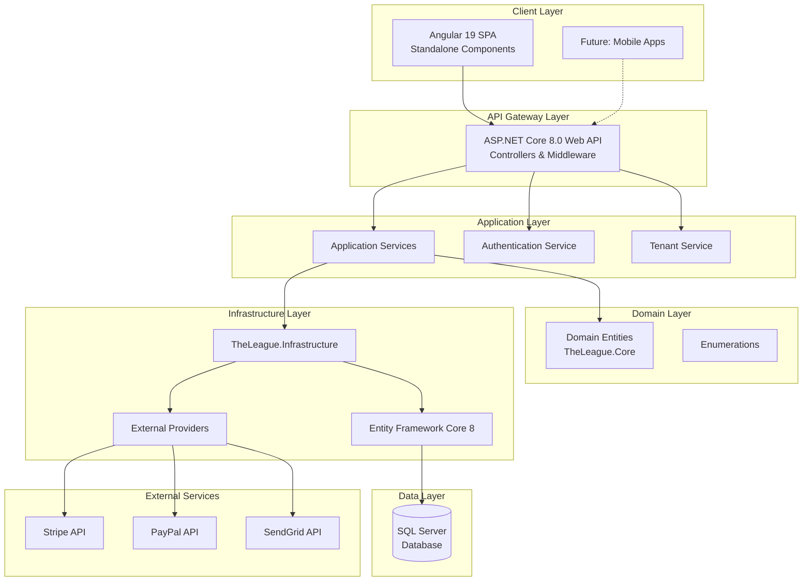
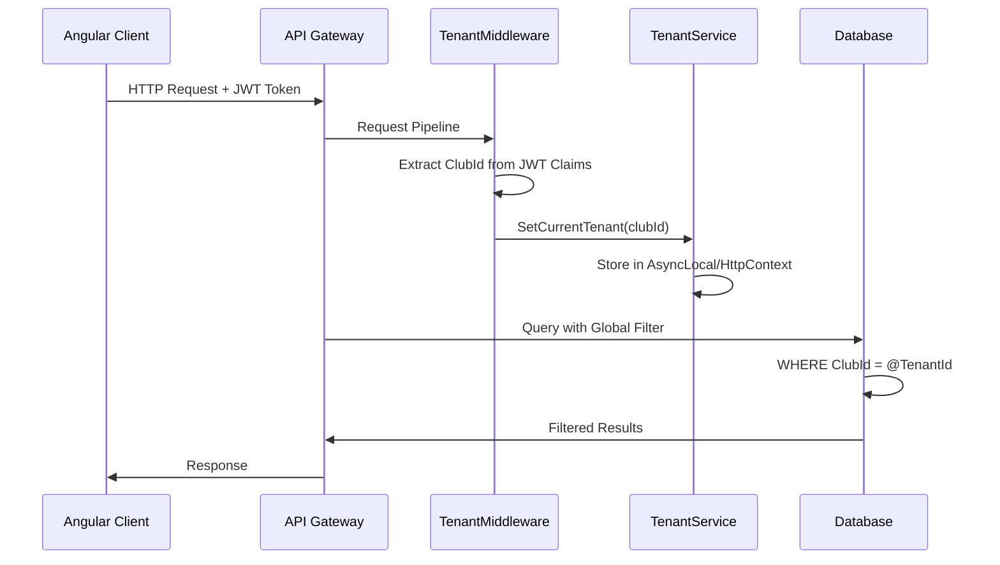
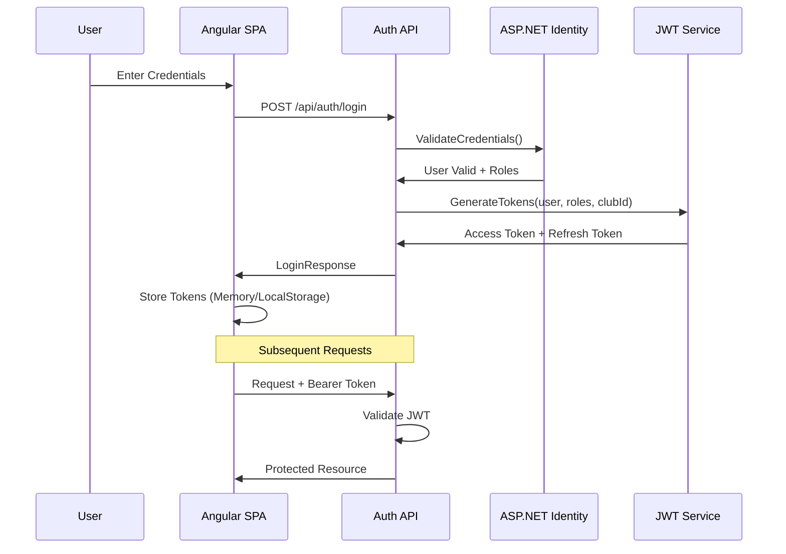
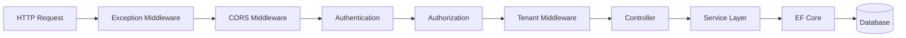
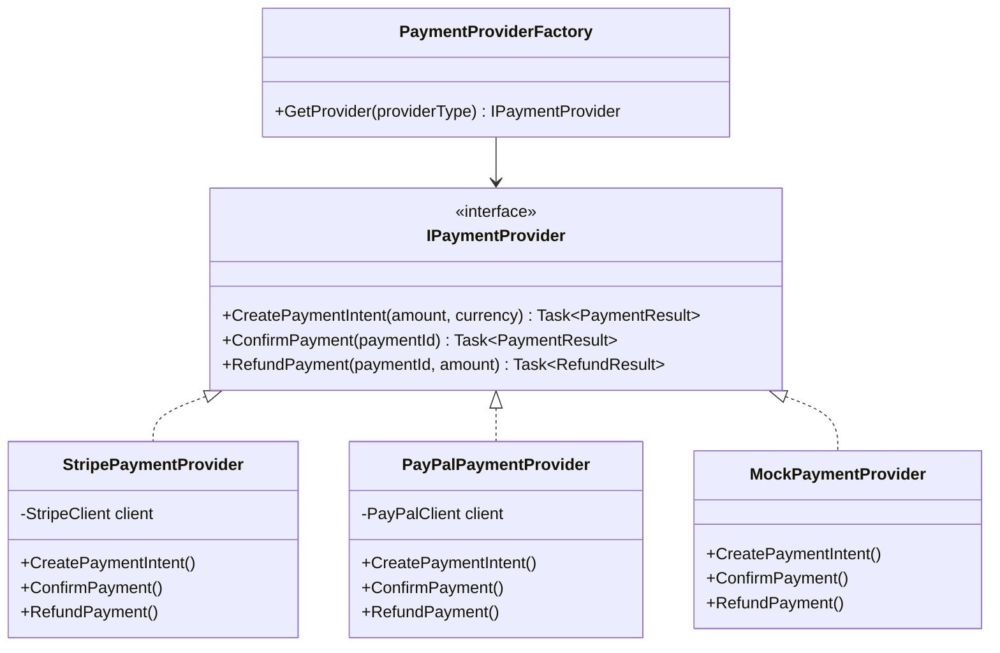
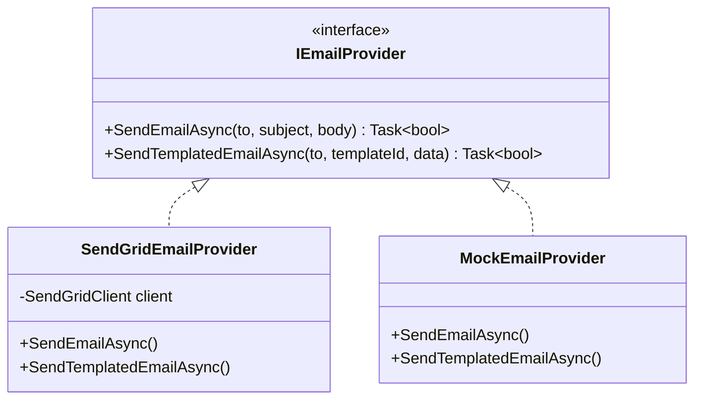
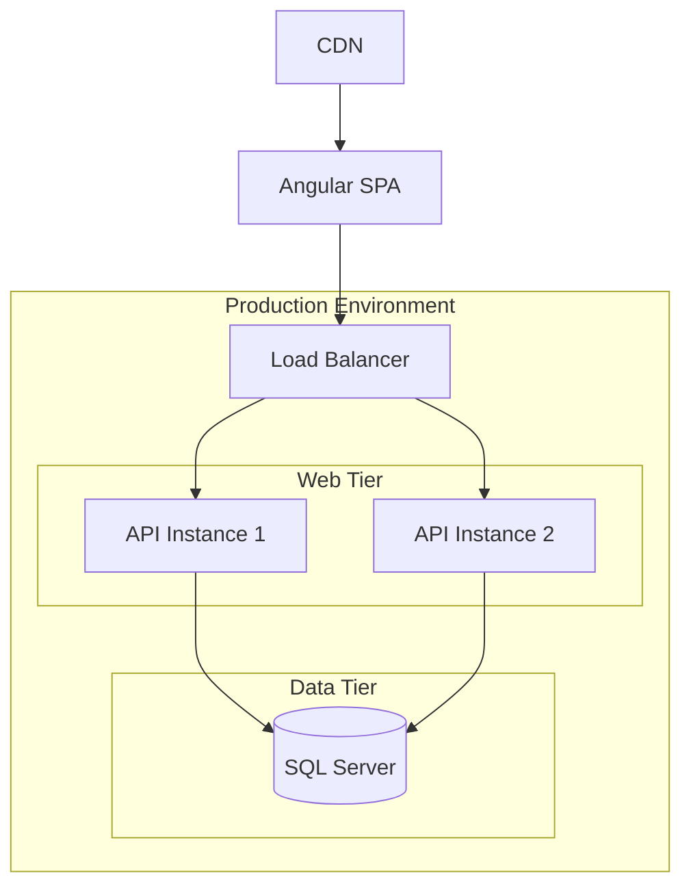

# The League - Technical Architecture Document

## System Architecture Overview

The League is built as a modern, multi-tenant SaaS application following Clean Architecture principles. The system consists of a RESTful API backend built with ASP.NET Core 8.0 and a Single Page Application (SPA) frontend built with Angular 19.



---

## Technology Stack

### Backend Technologies

| Component | Technology | Version | Justification |
|-----------|------------|---------|---------------|
| **Runtime** | .NET | 8.0 LTS | Long-term support, performance improvements, latest C# features |
| **Web Framework** | ASP.NET Core | 8.0 | Industry standard for enterprise .NET APIs, excellent performance |
| **ORM** | Entity Framework Core | 8.0 | Microsoft's recommended ORM, LINQ support, migrations |
| **Database** | SQL Server | 2022 | Robust RDBMS, excellent .NET integration, Azure compatibility |
| **Identity** | ASP.NET Core Identity | 8.0 | Built-in user management, role-based access, extensible |
| **Authentication** | JWT Bearer | - | Stateless authentication, industry standard, mobile-friendly |
| **API Documentation** | Swagger/OpenAPI | 6.5 | Interactive API documentation, client generation |
| **Dependency Injection** | Built-in DI | - | Native to ASP.NET Core, no external dependencies |

### Frontend Technologies

| Component | Technology | Version | Justification |
|-----------|------------|---------|---------------|
| **Framework** | Angular | 19.2 | Enterprise-grade SPA framework, TypeScript-first, strong typing |
| **Components** | Standalone Components | - | Modern Angular pattern, improved tree-shaking, simpler module structure |
| **State Management** | Services + RxJS | - | Built-in Angular patterns, reactive streams |
| **CSS Framework** | Tailwind CSS | 3.4 | Utility-first CSS, rapid development, consistent design |
| **HTTP Client** | Angular HttpClient | - | Built-in, observable-based, interceptor support |
| **Charts** | Chart.js + ng2-charts | 4.5 / 6.0 | Lightweight, responsive charts, good Angular integration |
| **Build Tool** | Angular CLI | 19.2 | Official tooling, optimized builds, code generation |

### Infrastructure & DevOps

| Component | Technology | Justification |
|-----------|------------|---------------|
| **Source Control** | Git | Industry standard, GitHub integration |
| **IDE** | Visual Studio 2022 / VS Code | Microsoft ecosystem, excellent .NET and Angular support |
| **Local Database** | LocalDB | Lightweight SQL Server for development |
| **API Testing** | Swagger UI | Interactive API exploration and testing |
| **E2E Testing** | Playwright | Modern, reliable cross-browser testing |
| **Unit Testing** | xUnit / Karma + Jasmine | Standard testing frameworks for .NET and Angular |

---

## Solution Structure

```
LeagueMembershipManagementPortal/
├── TheLeague.sln                     # Visual Studio Solution
├── TheLeague.Api/                    # Web API Project (Presentation Layer)
│   ├── Controllers/                  # API Controllers
│   │   ├── AuthController.cs
│   │   ├── MembersController.cs
│   │   ├── SessionsController.cs
│   │   ├── EventsController.cs
│   │   ├── PaymentsController.cs
│   │   └── ...
│   ├── DTOs/                         # Data Transfer Objects
│   │   ├── AuthDTOs.cs
│   │   ├── MemberDTOs.cs
│   │   └── ...
│   ├── Services/                     # Application Services
│   │   ├── Interfaces/
│   │   └── Implementations/
│   ├── Providers/                    # External Provider Abstractions
│   │   ├── Payment/
│   │   │   ├── IPaymentProvider.cs
│   │   │   ├── StripePaymentProvider.cs
│   │   │   └── MockPaymentProvider.cs
│   │   └── Email/
│   │       ├── IEmailProvider.cs
│   │       ├── SendGridEmailProvider.cs
│   │       └── MockEmailProvider.cs
│   ├── Middleware/                   # Custom Middleware
│   │   ├── TenantMiddleware.cs
│   │   └── ExceptionHandlingMiddleware.cs
│   ├── Program.cs                    # Application Entry Point
│   └── appsettings.json              # Configuration
│
├── TheLeague.Core/                   # Domain Layer (Entities & Enums)
│   ├── Entities/                     # Domain Entities
│   │   ├── Club.cs
│   │   ├── Member.cs
│   │   ├── Membership.cs
│   │   └── ...
│   └── Enums/                        # Domain Enumerations
│       └── Enums.cs
│
├── TheLeague.Infrastructure/         # Infrastructure Layer
│   └── Data/
│       ├── ApplicationDbContext.cs   # EF Core DbContext
│       ├── ITenantService.cs         # Tenant Abstraction
│       ├── TenantService.cs          # Tenant Implementation
│       └── Migrations/               # EF Core Migrations
│
├── TheLeague.Tests/                  # Unit & Integration Tests
│
└── the-league-client/                # Angular Frontend
    ├── src/
    │   ├── app/
    │   │   ├── core/                 # Core Module (Services, Guards, Models)
    │   │   │   ├── services/
    │   │   │   ├── guards/
    │   │   │   ├── interceptors/
    │   │   │   └── models/
    │   │   ├── shared/               # Shared Module (Components, Pipes)
    │   │   │   ├── components/
    │   │   │   └── pipes/
    │   │   ├── features/             # Feature Modules (Lazy-Loaded)
    │   │   │   ├── auth/
    │   │   │   ├── admin/
    │   │   │   ├── club/
    │   │   │   └── portal/
    │   │   ├── layouts/              # Layout Components
    │   │   ├── app.routes.ts
    │   │   └── app.config.ts
    │   └── environments/
    ├── tailwind.config.js
    └── angular.json
```

---

## Multi-Tenancy Architecture

### Strategy: Shared Database with Discriminator Column

All tenant data is stored in a single database with a `ClubId` column on each tenant-scoped table. This approach was chosen for:

1. **Cost Efficiency** - Single database reduces infrastructure costs
2. **Simpler Operations** - One database to backup, maintain, and scale
3. **Easier Reporting** - Cross-tenant analytics possible when needed
4. **Rapid Onboarding** - New clubs require no infrastructure provisioning

### Tenant Resolution Flow



### Implementation Details

**TenantMiddleware.cs:**
```csharp
public class TenantMiddleware
{
    public async Task InvokeAsync(HttpContext context, ITenantService tenantService)
    {
        // Extract ClubId from JWT claims after authentication
        var clubIdClaim = context.User.FindFirst("ClubId")?.Value;

        if (Guid.TryParse(clubIdClaim, out var clubId))
        {
            tenantService.SetCurrentTenant(clubId);
        }

        await _next(context);
    }
}
```

**Global Query Filters (ApplicationDbContext.cs):**
```csharp
protected override void OnModelCreating(ModelBuilder builder)
{
    var tenantId = _tenantService?.CurrentTenantId;

    if (tenantId.HasValue && tenantId.Value != Guid.Empty)
    {
        // Apply filter to all tenant-scoped entities
        builder.Entity<Member>().HasQueryFilter(e => e.ClubId == tenantId);
        builder.Entity<Session>().HasQueryFilter(e => e.ClubId == tenantId);
        builder.Entity<Payment>().HasQueryFilter(e => e.ClubId == tenantId);
        // ... all 50+ tenant-scoped entities
    }
}
```

---

## Authentication & Authorization

### Authentication Flow



### Token Structure

**Access Token Claims:**
- `sub` (NameIdentifier) - User ID
- `email` - User email
- `role` - User role (SuperAdmin, ClubManager, Member)
- `ClubId` - Tenant identifier
- `ClubSlug` - Club URL slug
- `exp` - Expiration (15 minutes)

**Token Lifetimes:**
- Access Token: 15 minutes
- Refresh Token: 7 days

### Role-Based Access Control

| Role | Access Level | Capabilities |
|------|--------------|--------------|
| **SuperAdmin** | System-wide | All clubs, system configuration, user management |
| **ClubManager** | Single Club | Full access to assigned club's data |
| **Member** | Self-service | Own profile, bookings, payments, events |

---

## Data Flow Architecture

### Request Processing Pipeline



### Service Layer Pattern

Each domain area follows a consistent pattern:

```csharp
// Interface in Services/Interfaces/
public interface IMemberService
{
    Task<PagedResult<MemberDto>> GetMembersAsync(MemberQueryParams queryParams);
    Task<MemberDto?> GetMemberByIdAsync(Guid id);
    Task<MemberDto> CreateMemberAsync(CreateMemberRequest request);
    Task<MemberDto> UpdateMemberAsync(Guid id, UpdateMemberRequest request);
    Task DeleteMemberAsync(Guid id);
}

// Implementation in Services/
public class MemberService : IMemberService
{
    private readonly ApplicationDbContext _context;
    private readonly ITenantService _tenantService;

    // Global filters automatically applied via DbContext
}
```

---

## External Integration Architecture

### Payment Provider Abstraction



### Email Provider Abstraction



---

## Security Architecture

### Security Layers

| Layer | Mechanism | Implementation |
|-------|-----------|----------------|
| **Transport** | HTTPS/TLS | Enforced in production |
| **Authentication** | JWT Bearer | 15-minute expiry, refresh tokens |
| **Authorization** | Role + Resource-based | Claims + ownership checks |
| **Data Isolation** | Global Query Filters | Automatic tenant filtering |
| **Input Validation** | Data Annotations + FluentValidation | Request DTOs validated |
| **SQL Injection** | Parameterized Queries | EF Core LINQ |
| **XSS Prevention** | Angular sanitization | Built-in protection |
| **CORS** | Whitelist Origins | Configured per environment |
| **Secrets** | Configuration/KeyVault | No secrets in code |

### Password Policy

```csharp
options.Password.RequireDigit = true;
options.Password.RequireLowercase = true;
options.Password.RequireUppercase = true;
options.Password.RequireNonAlphanumeric = false;
options.Password.RequiredLength = 6;
```

### Rate Limiting (Recommended)

| Endpoint Type | Limit | Window |
|--------------|-------|--------|
| Authentication | 10 requests | Per minute |
| API (Authenticated) | 100 requests | Per minute |
| API (Anonymous) | 20 requests | Per minute |

---

## Caching Strategy (Future Enhancement)

### Recommended Caching Layers

| Data Type | Cache Location | TTL | Invalidation |
|-----------|----------------|-----|--------------|
| Reference Data (MembershipTypes, Venues) | In-Memory | 5 minutes | On update |
| User Claims | JWT | 15 minutes | On refresh |
| Dashboard Statistics | Redis | 1 minute | Time-based |
| Report Data | Redis | 5 minutes | On data change |

---

## Error Handling

### Global Exception Handler

```csharp
public class ExceptionHandlingMiddleware
{
    public async Task InvokeAsync(HttpContext context)
    {
        try
        {
            await _next(context);
        }
        catch (Exception ex)
        {
            await HandleExceptionAsync(context, ex);
        }
    }

    private async Task HandleExceptionAsync(HttpContext context, Exception exception)
    {
        var response = exception switch
        {
            ValidationException => (400, "Validation failed"),
            UnauthorizedAccessException => (401, "Unauthorized"),
            NotFoundException => (404, "Resource not found"),
            _ => (500, "An error occurred")
        };

        // Log exception, return standardized error response
    }
}
```

### API Response Format

```json
{
  "success": false,
  "message": "Validation failed",
  "errors": [
    "Email is required",
    "Password must be at least 6 characters"
  ],
  "data": null
}
```

---

## Logging & Monitoring (Recommended)

### Logging Strategy

| Log Level | Usage |
|-----------|-------|
| **Error** | Exceptions, failed operations |
| **Warning** | Recoverable issues, deprecations |
| **Information** | Key business events (user login, payment processed) |
| **Debug** | Detailed flow information (development only) |

### Recommended Monitoring Tools

- **Application Insights** - APM, request tracing, exceptions
- **Seq / ELK Stack** - Structured log aggregation
- **Health Checks** - Database connectivity, external services

---

## Scalability Considerations

### Horizontal Scaling

The application is designed for horizontal scaling:

- **Stateless API** - No server-side session, JWT-based auth
- **Database Connection Pooling** - Managed by EF Core
- **Tenant Isolation** - No cross-tenant operations required

### Performance Optimizations

- **Async/Await** - All I/O operations are asynchronous
- **Pagination** - All list endpoints support pagination
- **Projection** - DTOs loaded with specific columns, not full entities
- **Indexes** - Composite indexes on ClubId + frequently queried columns
- **Lazy Loading Disabled** - Explicit includes prevent N+1 queries

---

## Deployment Architecture



---

## Technology Decision Records

### ADR-001: Multi-Tenant Strategy

**Decision:** Shared database with ClubId discriminator column

**Context:** Need to support multiple clubs with data isolation

**Alternatives Considered:**
1. Database per tenant - Higher cost, complex operations
2. Schema per tenant - Complex migrations, connection management

**Consequences:**
- Simpler infrastructure
- Lower cost
- Requires careful query filter implementation
- Cross-tenant queries need explicit handling

---

### ADR-002: Angular Standalone Components

**Decision:** Use Angular 19 standalone components instead of NgModules

**Context:** Angular 19 promotes standalone components as the default

**Consequences:**
- Simpler component structure
- Better tree-shaking
- Easier lazy loading
- Aligns with Angular's future direction

---

### ADR-003: Tailwind CSS

**Decision:** Use Tailwind CSS for styling instead of component libraries

**Context:** Need consistent, maintainable styling with mobile-first design

**Alternatives Considered:**
1. Angular Material - Heavier, less customizable
2. Bootstrap - Dated appearance, less flexible
3. Custom CSS - Time-consuming, inconsistent

**Consequences:**
- Rapid UI development
- Consistent design system
- Smaller bundle size
- Learning curve for utility-first CSS

---

*Document Version: 1.0*
*Last Updated: Pre-Development Planning Phase*
